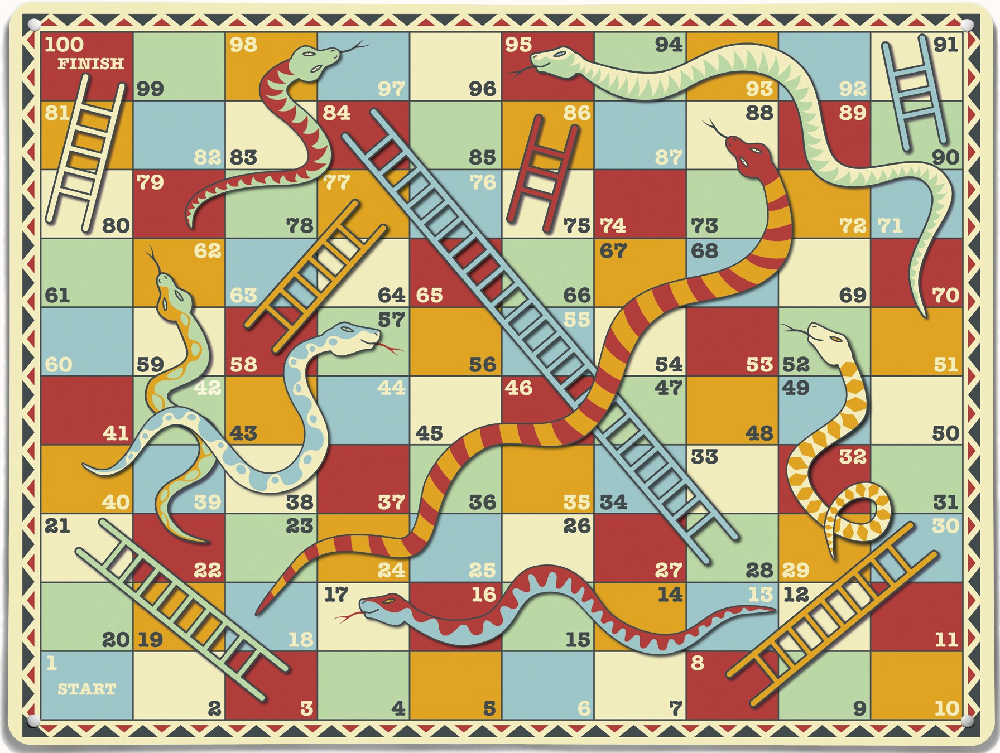

# Cours 13
## Préparation de la présentation 3 
Joindre des images de votre tempête d'idée et des esquisses de votre projet. Expliquer en 2 à 3 lignes votre projet. 
Mon projet est un jeux hybridre entre jeux vidéo et jeux de société.cest un jeux qui se joue sur une planche carreauté. les joueursr lancent un dé pour savoir de combien de case que son pion peut avancer.certaine cases contiennent des code qr que les joueur doivent scanner avec leur telephone. ce lien es emmènera vers un bos s quils devront battrer pour rester sur la case sur laquel ils sont.

