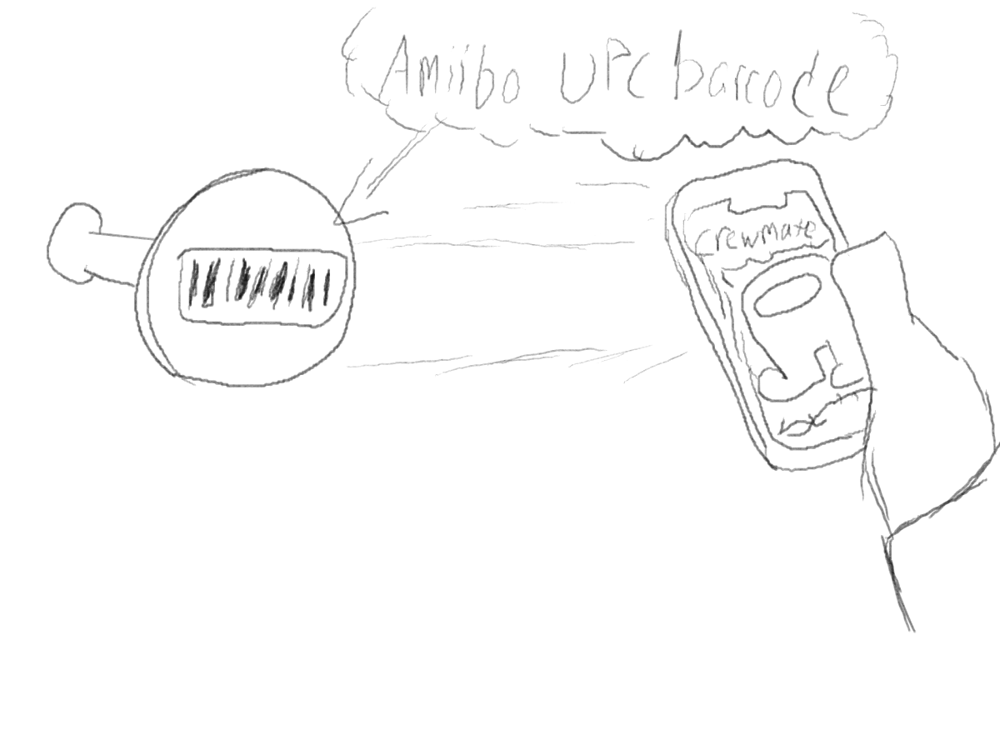
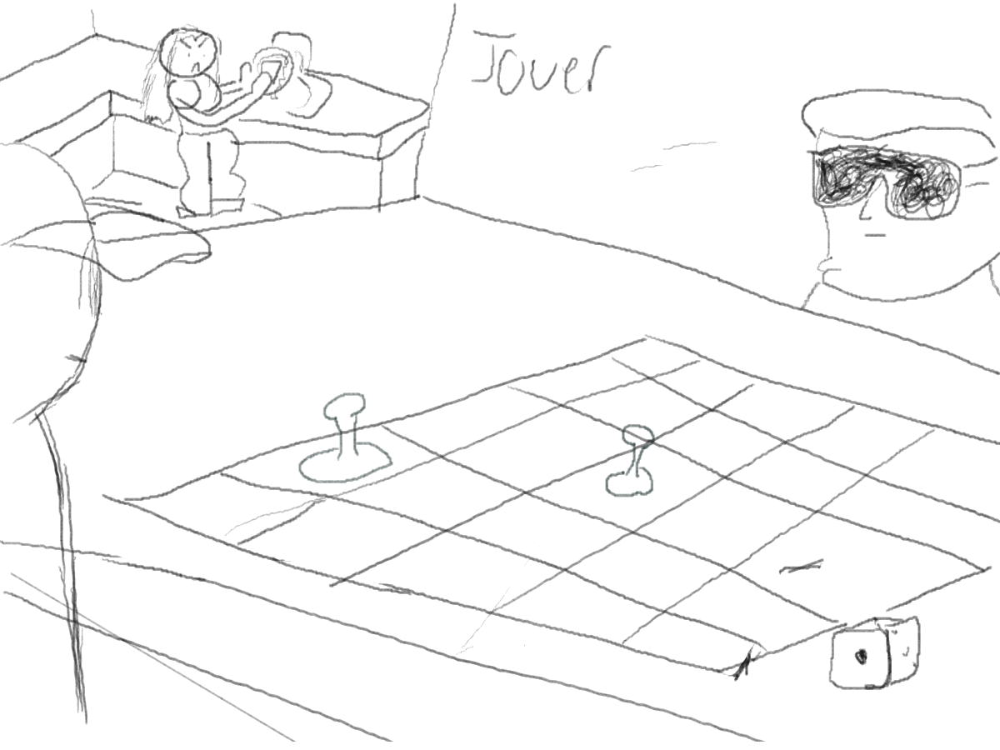
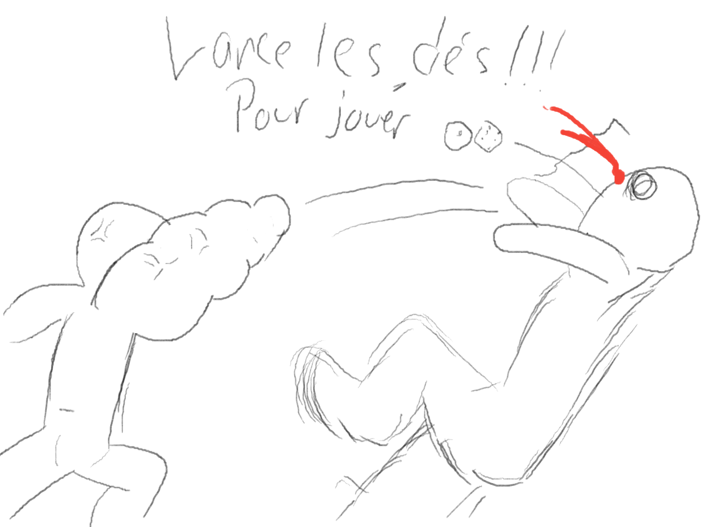
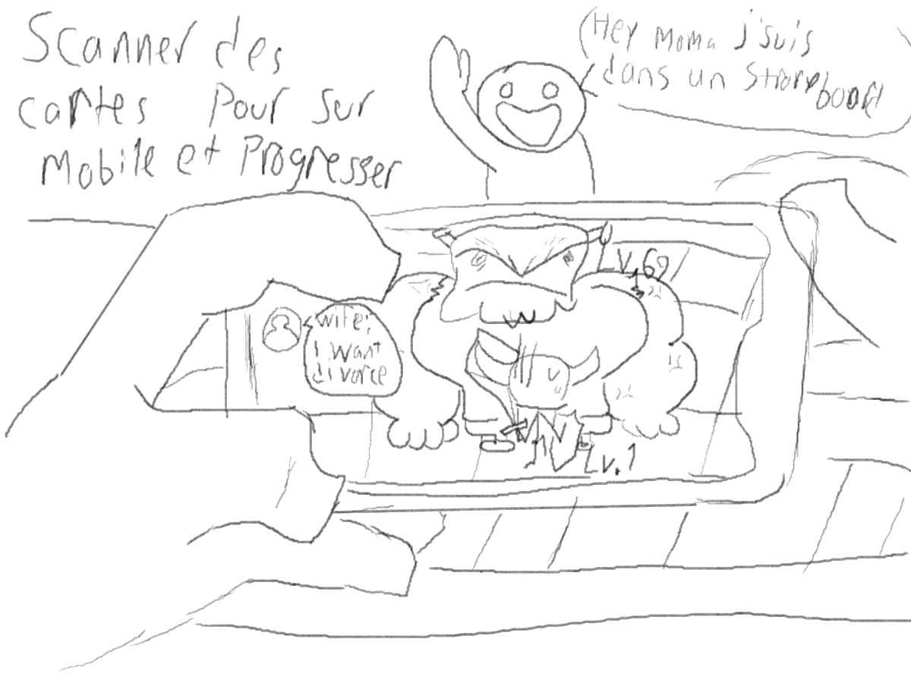
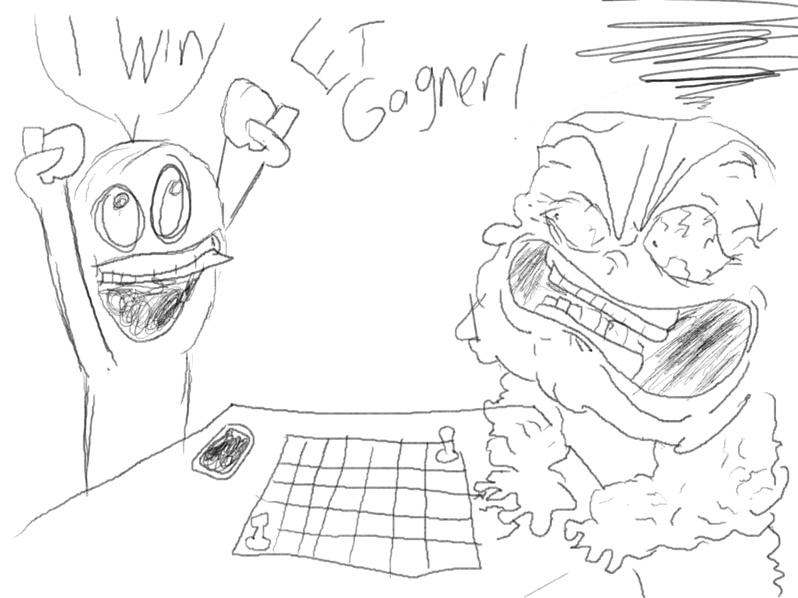
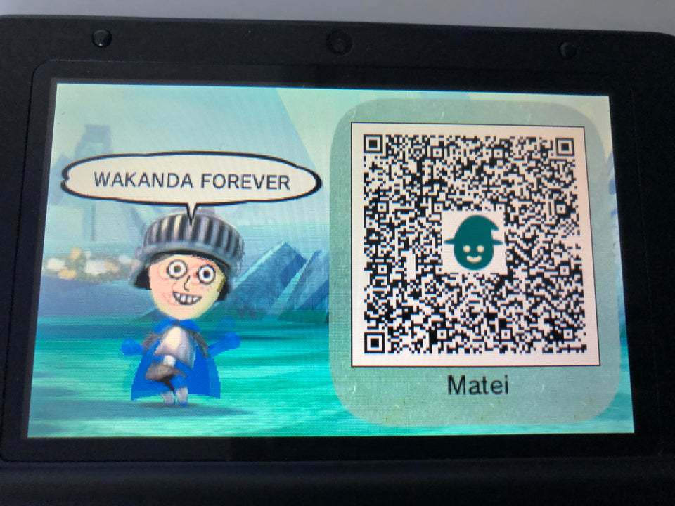
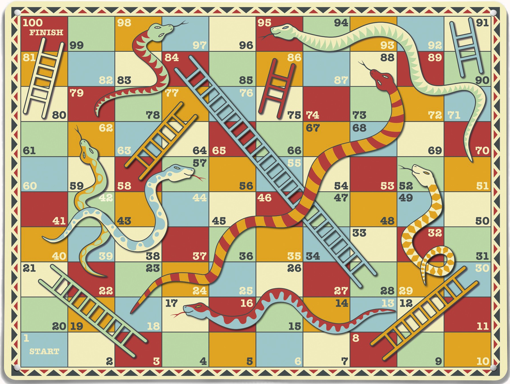

# Cours 14
## Plan de la présentation 3
Durée: 8 à 10 minutes

### Résumer votre projet en une phrase
Viking Échelle est un jeux hybride dont est utilisé des codes Qr à travers leur téléphone afin de pouvoir avancer son pion dans le jeu de société.

### Description du projet 
Décrivez les grandes lignes de votre projet. 

### Schéma du projet ou scénarimage

### Moodboard
Montrer nous l'allure visuelle et sonore qu'aura votre projet à l'aide d'un moodboard, de maquettes ou de croquis. 

https://www.youtube.com/watch?v=VhkfnPVQyaY&t=62s

### Technologies
 Code Qr

### Étapes de réalisation
Animation 2D
Gestionnaire de projet
Développeur front-end
Développeur back-end
Programmation
Directeur Artistique
Contrôle de aualité

